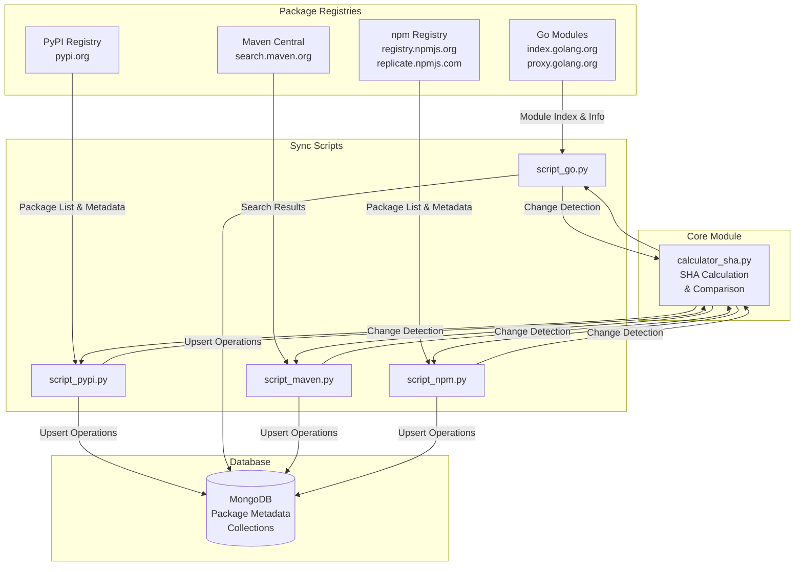
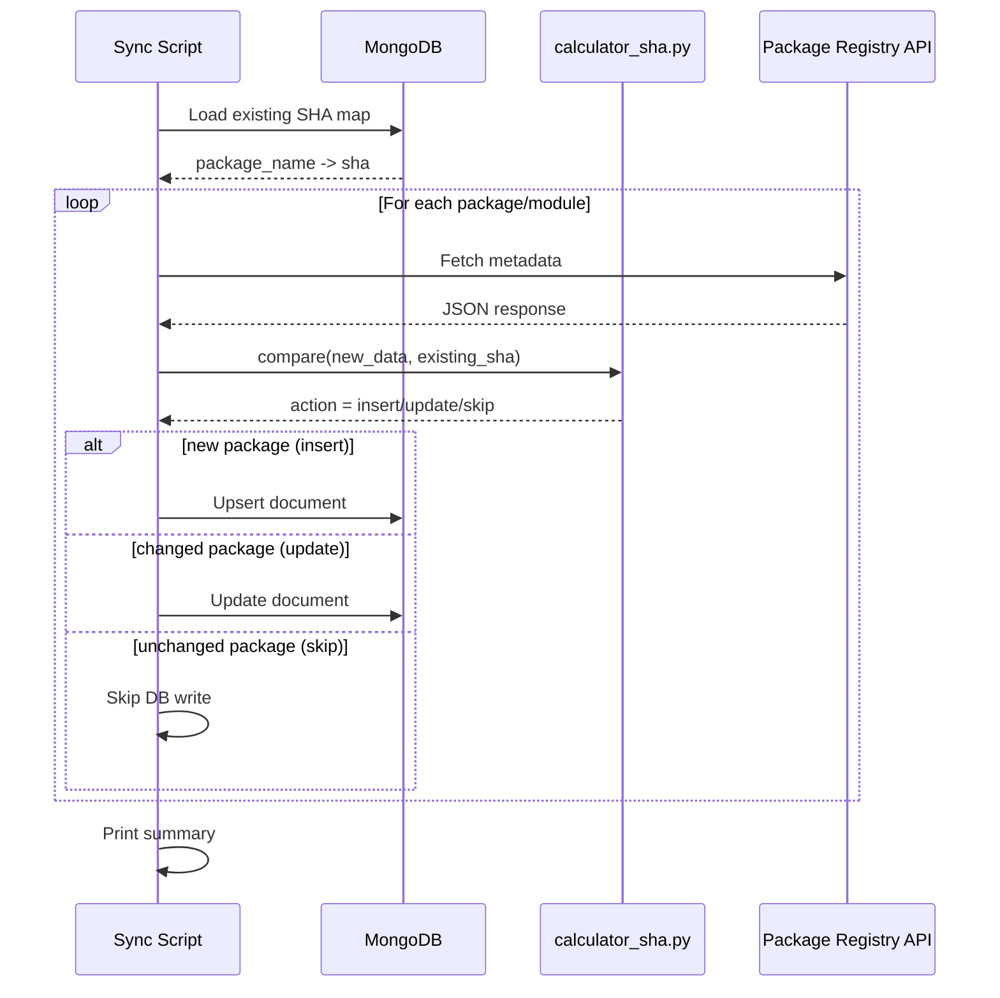

# SBOM Metadata Sync System Documentation

## Overview

The SBOM (Software Bill of Materials) Metadata Sync System is a Python-based asynchronous data collection pipeline that synchronizes package metadata from three major package registries (PyPI, Go Modules, and Maven Central) into MongoDB. The system uses SHA-256 hashing to detect changes and only updates records when metadata has actually changed, optimizing database writes and network usage.

## System Architecture



## File Descriptions

### `calculator_sha.py`
**Purpose**: Core utility module for SHA-256 hash calculation and change detection.

**Key Components**:
- `PackageDocument`: Pydantic model defining the MongoDB document structure
- `calculate_full_response_sha()`: Computes SHA-256 hash of normalized JSON data
- `compare()`: Compares new data against existing SHA to determine action (insert/update/skip)

**Returns**: Tuple of `(new_sha, processed_data, action)` where action is `'insert'`, `'update'`, or `'skip'`

### `script_pypi.py`
**Purpose**: Synchronizes Python package metadata from PyPI (Python Package Index).

**Workflow**:
1. Fetches complete package list from PyPI Simple API
2. Loads existing SHA hashes from MongoDB into memory
3. Concurrently fetches metadata for each package (50 concurrent requests)
4. Compares SHA hashes to detect changes
5. Performs bulk upsert operations for new/updated packages
6. Skips packages with unchanged metadata

**Collection**: `Updated_pypi_metadata`

### `script_go.py`
**Purpose**: Synchronizes Go module metadata from Go Index and Proxy.

**Workflow**:
1. Loads existing SHA hashes from MongoDB
2. Fetches module index feed from `index.golang.org` (NDJSON format)
3. For each module, fetches detailed info from `proxy.golang.org`
4. Uses pagination with `since` parameter for incremental sync
5. Compares SHA hashes and updates only changed modules

**Collection**: `Updated_go_metadata`

**Note**: Configurable `MAX_PAGES` limit to control sync depth

### `script_maven.py`
**Purpose**: Synchronizes Maven artifact metadata from Maven Central Search API.

**Workflow**:
1. Loads existing SHA hashes from MongoDB
2. Generates search prefixes (common groups + alphabetical combinations)
3. For each prefix, paginates through Solr search results
4. Processes artifacts with SHA comparison
5. Handles rate limiting (lower concurrency: 5 concurrent requests)

**Collection**: `Updated_maven_metadata`

**Strategy**: Uses prefix-based search (e.g., `org.apache*`, `aa*`, `ab*`) to discover artifacts

### `requirements.txt`
**Purpose**: Python dependency specification file.

**Key Dependencies**:
- `aiohttp`: Async HTTP client for concurrent API requests
- `pymongo`: MongoDB driver
- `pydantic`: Data validation and serialization
- `tqdm`: Progress bar visualization
- `python-dotenv`: Environment variable management

## Workflow Diagram



## How It Works

### 1. SHA-Based Change Detection

The system uses SHA-256 hashing to detect metadata changes without storing full comparison data:

1. **Normalization**: JSON data is normalized (sorted keys, consistent formatting)
2. **Hashing**: SHA-256 hash is computed on the normalized JSON string
3. **Comparison**: New hash is compared against stored hash in memory map
4. **Action Decision**:
   - **Insert**: Package doesn't exist (no SHA in DB)
   - **Update**: SHA changed (metadata modified)
   - **Skip**: SHA unchanged (no modifications)

### 2. Memory-Optimized Processing

- **SHA Map Loading**: All existing SHA hashes are loaded into memory at startup
- **In-Memory Updates**: SHA map is updated during processing for subsequent comparisons
- **Batch Writes**: Database operations are batched (100 operations per batch) for efficiency

### 3. Concurrent Processing

- **PyPI**: 50 concurrent HTTP requests
- **Go**: 50 concurrent HTTP requests
- **Maven**: 5 concurrent HTTP requests (rate limit sensitive)

### 4. Data Structure

Each MongoDB document follows this structure. The `_id` field is automatically generated by MongoDB:

**Example Document (Maven):**
```json
{
  "_id": ObjectId("696f6151777a2c0407bbea73"),
  "package_name": "org.opendaylight.odlparent:odl-jakarta-activation-api",
  "sha": "fb8ae86ee6038c90583e300f8d3c3c33a7adba892879b841bb1088db7af852d7",
  "updated_time": "2026-01-20T13:10:54.320+00:00",
  "object": {
    /* Full metadata from registry API */
    /* For Maven: groupId, artifactId, version, timestamp, etc. */
    /* For PyPI: info, releases, urls, etc. */
    /* For Go: name, latest_version, timestamp, source, etc. */
  }
}
```

**Field Descriptions:**
- `_id`: MongoDB ObjectId (auto-generated)
- `package_name`: Unique package identifier
  - **Maven**: `groupId:artifactId` (e.g., `org.apache.logging.log4j:log4j-jakarta-jms`)
  - **PyPI**: Package name (e.g., `requests`)
  - **Go**: Module path (e.g., `github.com/gin-gonic/gin`)
- `sha`: SHA-256 hash of the normalized metadata (64-character hex string)
- `updated_time`: ISO-8601 timestamp (only present when package was updated, not on initial insert)
- `object`: Complete metadata object from the package registry API

**Note**: The `updated_time` field is only set when a package is updated (SHA changed). New packages (inserts) do not have this field initially.

## Usage

### Prerequisites

1. Python 3.11+
2. MongoDB instance (local or remote)
3. Environment variables configured in `.env` file:
   ```
   MONGO_URI=mongodb://localhost:27017
   MONGO_DB_NAME=sbom_db
   ```

### Installation

```bash
pip install -r requirements.txt
```

### Running the Scripts

**PyPI Sync**:
```bash
python script_pypi.py
```

**Go Modules Sync**:
```bash
python script_go.py
```

**Maven Central Sync**:
```bash
python script_maven.py
```

### Configuration

Each script has configurable parameters at the top:

- `CONCURRENCY_LIMIT`: Number of parallel HTTP requests
- `BATCH_SIZE`: Database write batch size
- `MAX_PAGES` (Go only): Limit on index pages to process

### Output

Each script provides:
- Progress bars showing sync status
- Real-time counters (inserted/updated/skipped)
- Final summary statistics

Example output:
```
PYPI IMPORT SUMMARY
Total packages processed:  500,000
Packages inserted: 1,234
Packages updated: 567
Packages skipped: 498,199
```

## Performance Characteristics

- **Efficiency**: Only writes to DB when data changes (SHA mismatch)
- **Scalability**: Handles millions of packages with in-memory SHA comparison
- **Resilience**: Error handling for network failures, rate limits, and DB errors
- **Optimization**: Batch writes reduce database round-trips

## Database Collections

### Collections

- `Updated_pypi_metadata`: Python packages from PyPI
- `Updated_go_metadata`: Go modules from Go Index/Proxy
- `Updated_maven_metadata`: Maven artifacts from Maven Central

All collections have a unique index on `package_name` for fast lookups and upsert operations.

### Example Documents

**Maven Document:**
```json
{
  "_id": ObjectId("696f6151777a2c0407bbea73"),
  "package_name": "org.apache.logging.log4j:log4j-jakarta-jms",
  "sha": "8136736765f7243ebf6e27f91b6b3fa323bc7ca7a5cab0a157d3f49ebefc2f9c",
  "updated_time": "2026-01-20T13:10:54.320+00:00",
  "object": {
    "id": "org.apache.logging.log4j:log4j-jakarta-jms",
    "g": "org.apache.logging.log4j",
    "a": "log4j-jakarta-jms",
    "v": "3.0.0",
    "timestamp": 1234567890000
  }
}
```

**PyPI Document:**
```json
{
  "_id": ObjectId("..."),
  "package_name": "requests",
  "sha": "a1b2c3d4e5f6...",
  "object": {
    "info": { "name": "requests", "version": "2.31.0", ... },
    "releases": { ... }
  }
}
```

**Go Module Document:**
```json
{
  "_id": ObjectId("..."),
  "package_name": "github.com/gin-gonic/gin",
  "sha": "f1e2d3c4b5a6...",
  "object": {
    "name": "github.com/gin-gonic/gin",
    "latest_version": "v1.9.1",
    "timestamp": "2024-01-15T10:30:00Z",
    "source": "proxy.golang.org"
  }
}
```


Overview

The SBOM (Software Bill of Materials) Metadata Sync System is a Python-based asynchronous data collection pipeline that synchronizes package metadata from three major package registries (PyPI, Go Modules, and Maven Central) into MongoDB. The system uses SHA-256 hashing to detect changes and only updates records when metadata has actually changed, optimizing database writes and network usage.


System Architecture


File Descriptions

calculator_sha.py:

Purpose: Core utility module for SHA-256 hash calculation and change detection.

Key Components:

PackageDocument: Pydantic model defining the MongoDB document structure

calculate_full_response_sha(): Computes SHA-256 hash of normalized JSON data

compare(): Compares new data against existing SHA to determine action (insert/update/skip)

Returns: Tuple of (new_sha, processed_data, action) where action is 'insert', 'update', or 'skip'


script_pypi.py

Purpose: Synchronizes Python package metadata from PyPI (Python Package Index).

Workflow:

Fetches complete package list from PyPI Simple API

Loads existing SHA hashes from MongoDB into memory

Concurrently fetches metadata for each package (50 concurrent requests)

Compares SHA hashes to detect changes

Performs bulk upsert operations for new/updated packages

Skips packages with unchanged metadata

Collection: Updated_pypi_metadata


script_go.py

Purpose: Synchronizes Go module metadata from Go Index and Proxy.

Workflow:

Loads existing SHA hashes from MongoDB

Fetches module index feed from index.golang.org (NDJSON format)

For each module, fetches detailed info from proxy.golang.org

Uses pagination with since parameter for incremental sync

Compares SHA hashes and updates only changed modules

Collection: Updated_go_metadata

Note: Configurable MAX_PAGES limit to control sync depth


script_maven.py

Purpose: Synchronizes Maven artifact metadata from Maven Central Search API.

Workflow:

Loads existing SHA hashes from MongoDB

Generates search prefixes (common groups + alphabetical combinations)

For each prefix, paginates through Solr search results

Processes artifacts with SHA comparison

Handles rate limiting (lower concurrency: 5 concurrent requests)

Collection: Updated_maven_metadata

Strategy: Uses prefix-based search (e.g., org.apache*, aa*, ab*) to discover artifacts


requirements.txt

Purpose: Python dependency specification file.

Key Dependencies:

aiohttp: Async HTTP client for concurrent API requests

pymongo: MongoDB driver

pydantic: Data validation and serialization

tqdm: Progress bar visualization

python-dotenv: Environment variable management


Workflow Diagram


How It Works

1. SHA-Based Change Detection

The system uses SHA-256 hashing to detect metadata changes without storing full comparison data:

Normalization: JSON data is normalized (sorted keys, consistent formatting)

Hashing: SHA-256 hash is computed on the normalized JSON string

Comparison: New hash is compared against stored hash in memory map

Action Decision:

Insert: Package doesn't exist (no SHA in DB)

Update: SHA changed (metadata modified)

Skip: SHA unchanged (no modifications)

2. Memory-Optimized Processing

SHA Map Loading: All existing SHA hashes are loaded into memory at startup

In-Memory Updates: SHA map is updated during processing for subsequent comparisons

Batch Writes: Database operations are batched (100 operations per batch) for efficiency

3. Concurrent Processing

PyPI: 50 concurrent HTTP requests

Go: 50 concurrent HTTP requests

Maven: 5 concurrent HTTP requests (rate limit sensitive)


4. Data Structure

Each MongoDB document follows this structure. The _id field is automatically generated by MongoDB:

Example Document :

{
  "_id": ObjectId("696f6151777a2c0407bbea73"),
  "package_name": "...", 
  "sha": "...",
  "updated_time": "2026-01-20T13:10:54.320+00:00",
  "object": {
    /* Full metadata from registry API */
    /* For Maven: groupId, artifactId, version, timestamp, etc. */
    /* For PyPI: info, releases, urls, etc. */
    /* For Go: name, latest_version, timestamp, source, etc. */
  }
}


Field Descriptions:

_id: MongoDB ObjectId (auto-generated)

package_name: Unique package identifier

Maven: groupId:artifactId (e.g., org.apache.logging.log4j:log4j-jakarta-jms)

PyPI: Package name (e.g., requests)

Go: Module path (e.g., github.com/gin-gonic/gin)

sha: SHA-256 hash of the normalized metadata (64-character hex string)

updated_time: ISO-8601 timestamp (only present when package was updated, not on initial insert)

object: Complete metadata object from the package registry API

Note: The updated_time field is only set when a package is updated (SHA changed). do not have this field initially.

Usage

Prerequisites

Python 3.11+

MongoDB instance (local or remote)

Environment variables configured in .env file:

MONGO_URI=YOUR_MONGO_URL
MONGO_DB_NAME=DB_NAME


Installation

pip install -r requirements.txt


Running the Scripts

PyPI Sync:

python script_pypi.py


Go Modules Sync:

python script_go.py


Maven Central Sync:

python script_maven.py


Configuration

Each script has configurable parameters at the top:

CONCURRENCY_LIMIT: Number of parallel HTTP requests

BATCH_SIZE: Database write batch size

MAX_PAGES (Go only): Limit on index pages to process

Output

Each script provides:

Progress bars showing sync status

Real-time counters (inserted/updated/skipped)

Final summary statistics

Example output:

PYPI IMPORT SUMMARY
Total packages processed:  500,000
Packages inserted: 1,234
Packages updated: 567
Packages skipped: 498,199


Database Collections

Collections

Updated_pypi_metadata: Python packages from PyPI

Updated_go_metadata: Go modules from Go Index/Proxy

Updated_maven_metadata: Maven artifacts from Maven Central

All collections have a unique index on package_name for fast lookups and upsert operations.

Example Documents

Maven Document:

{
  "_id": ObjectId("..."),
  "package_name": "org.opendaylight.odlparent:odl-jakarta-activation-api",
  "sha": "...",
  "updated_time": "...",  //if data updated 
  "object": {
     metadata from API 
  }
}


PyPI Document:

{
  "_id": ObjectId("..."),
  "package_name": "requests",
  "sha": "...",
  "object": {
    metadata from API 
  }
}


Go Module Document:

